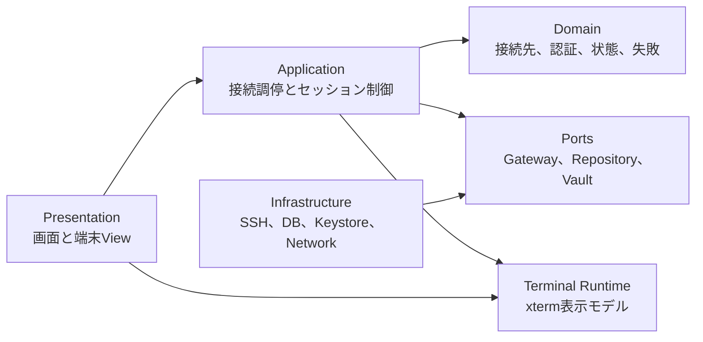
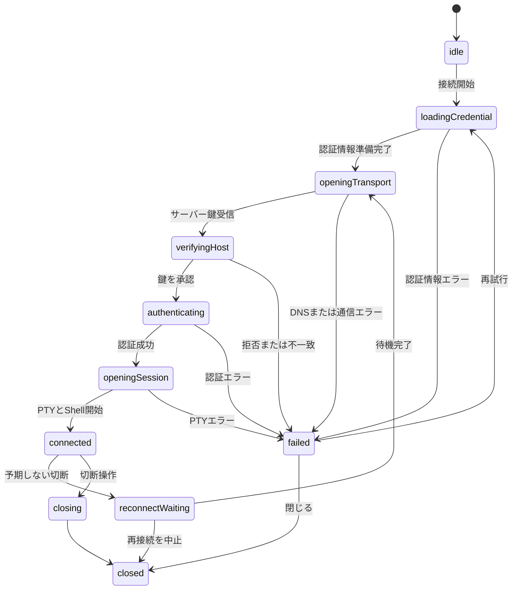
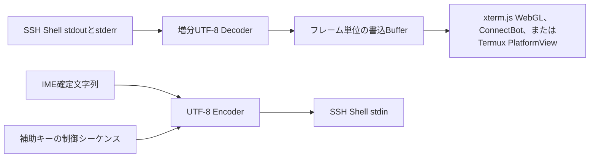

# Termethis アーキテクチャ

最終更新：2026年8月11日

状態：Termethis 0.4.0として、Android最適化と実用的なSSH／SFTP接続を実装済み

## 1. 対象と設計原則

このアプリは、Android端末からSSHサーバーへ接続して日本語を含む対話型シェルを操作し、FTPサーバー内のファイルを管理するFlutterアプリである。

初期対応OSはAndroidとするが、Domain層とApplication層にはAndroid APIを持ち込まない。

最低対応版はAPI 26とする。

SSHライブラリ、永続ストレージ、AndroidライフサイクルはPortを介して接続し、Flutterの画面とセッション制御から交換できるようにする。

設計では次の原則を優先する。

- **接続の正しさ**：接続段階、失敗理由、キャンセル、資源解放を状態機械で管理する
- **既知ホストの継続確認**：未知の鍵を確認し、登録済みの鍵が変わった接続を遮断する
- **秘密情報の局所化**：パスワードと秘密鍵を必要な時間だけメモリへ置き、ログと通常の永続ストレージへ渡さない
- **モバイル回線への耐性**：バックグラウンド移行、ネットワーク切り替え、遅延、瞬断を正常系として扱う
- **日本語端末の一貫性**：IME、UTF-8、文字幅、フォント、貼り付けを一つの入出力経路として検証する
- **観測可能性**：端末本文と入力内容を記録せず、接続段階と安全な診断値だけで障害を切り分ける

「接続できる」はTCP接続だけを指さない。

ホスト鍵検証、認証、PTY開始、双方向通信、切断検出、終了処理まで完了して初めて接続済みとする。

## 2. 実装状況と0.2系の範囲

### 2.1 0.1.0で動作している経路

現行コードには、実サーバーへ接続できる最小の縦の経路がある。

| 項目 | 現在の実装 |
|---|---|
| TCP接続 | 15秒の接続タイムアウト |
| SSHハンドシェイク | 暗号処理15秒。利用者のホスト鍵確認時間は除外 |
| 認証 | パスワード、複数回のkeyboard-interactive、OpenSSH秘密鍵 |
| ホスト鍵 | SHA-256フィンガープリントの確認と照合 |
| 接続先の保存 | DriftとSQLiteによる永続Repository |
| known_hostsの保存 | 正規化したホスト名とポート、複数承認鍵の永続Repository |
| Credential Vault | AES-256-GCM暗号化blobとAndroid Keystore配下の暗号鍵 |
| 秘密鍵インポート | Androidのネイティブファイル選択、形式とパスフレーズの検証 |
| Wake on LAN | 接続先ごとのMAC、IPv4ブロードキャスト先、UDPポート保存とMagic Packet送信 |
| PTY | `xterm-256color`、PTYとShell要求のパイプライン化 |
| 入出力 | 増分UTF-8デコード、日本語IME確定文字列の送信 |
| 端末制御 | `Ctrl`、`Alt`、補助キー、画面寸法変更 |
| 切断 | リモート切断とStreamエラーから再接続案内へ遷移 |
| 資源解放 | Session、Client、Socket、Stream購読を閉じる冪等処理 |
| 複数セッション | タブIDごとに独立したSSHセッションを保持し、同じ接続先も並行利用できる |
| セッションタブ保存 | タブID、接続先ID、表示名だけを保存し、再起動後は切断状態で復元する |
| SFTP | SSHのknown_hosts、パスワード認証、Credential Vaultの秘密鍵認証を再利用する |

接続先とknown_hostsの永続化は0.2系の段階1として実装済みである。

Repositoryの再起動試験では接続先と複数のホスト鍵が復元され、登録済みのどの鍵にも一致しない鍵を不一致と判定する。

秘密鍵と任意保存された鍵パスフレーズはCredential Vaultへ保存し、SQLiteには参照IDと表示用ファイル名だけを置く。

パスワードは接続ごとに入力し、永続化しない。

### 2.2 0.2系で実装する機能

0.2系では次の機能を実装対象とする。

- 認証方式と認証順序の明示
- 接続試行単位のキャンセルと段階別タイムアウト
- IPv4とIPv6を考慮した接続
- アプリ管理のkeepaliveと無応答判定
- ネットワーク復帰を待つ再接続
- 指数バックオフ付き自動再接続の任意設定
- サーバーバナー、切断理由、暗号ネゴシエーション結果の安全な診断表示
- 複数セッションとタブの独立した寿命管理（実装済み）
- OpenSSHテストサーバーを使った統合試験

自動再接続は既定で無効とする。

有効にした場合も端末入力を再送せず、新しいSSH接続と新しいPTYを開始する。

切断前のプロセス状態は復元できないため、継続が必要な利用者にはサーバー側の`tmux`または`screen`を案内する。

### 2.3 後続リリースへ分離する機能

次の機能は0.2系へ含めない。

- ローカル、リモート、Dynamicポートフォワーディング
- ProxyJumpと踏み台接続
- SSH AgentとFIDO2鍵の連携
- SSH証明書
- Mosh
- クラウド同期
- Shift_JISとEUC-JP
- バックグラウンドで無期限に接続を維持する機能

これらは`SshGateway`へ機能を足すのではなく、転送、踏み台、ファイル転送ごとのPortとして追加する。

## 3. 画面と利用者の操作

### 3.1 トップレベルナビゲーション

トップレベルは`ホーム`、`FTP`、`設定`の三画面で構成する。SSH、RDP、VNCはホームの接続先として扱い、接続方式ごとのトップレベル画面は増やさない。

幅600dp未満ではボトムナビゲーション、600dp以上では`NavigationRail`へ切り替える。

840dp以上ではRailを展開し、ラベルを常時表示する。

デスクトップ表示向けの接続先、ターミナル、SFTPの任意3ペインは次段階とし、1,200dp以上を候補閾値として情報密度とフォーカス移動を実機で検証してから有効化する。

各ブランチは`StatefulShellRoute`の`IndexedStack`で保持し、FTPタブと一覧位置をナビゲーション切り替えで破棄しない。

SSHターミナルや接続先編集のような集中操作はルートNavigatorへ表示し、ボトムナビゲーションを隠す。

### 3.2 接続先一覧

各項目には接続方式、表示名、接続先、ユーザー名を表示する。SSHは`user@host:port`、RDPとVNCは`user · host:port`形式を使い、ユーザー名が空なら`host:port`だけを表示する。

追加操作では最初にSSH、RDP、VNCをカードから選ぶ。選択した方式に必要な項目だけを次画面に表示し、既存接続先の方式は編集画面で変更しない。

メニューからWake on LAN、編集、複製、known_hostsの確認、削除を行えるようにする。

接続履歴には成否、失敗段階、時刻だけを保存し、端末本文と認証情報を含めない。

### 3.3 接続先編集

SSH編集画面は基本情報、認証、端末、接続維持、詳細設定の五つに分ける。RDPとVNCでは表示名、ホスト、ポート、ユーザー名、Wake on LANだけを扱う。

基本情報では表示名、ホスト、ポート、ユーザー名を編集する。

認証ではパスワード、秘密鍵、keyboard-interactiveのいずれを使うかと試行順序を設定する。

端末ではTERM、文字サイズ、スクロールバック行数、任意のロケール環境変数を設定する。

接続維持ではkeepalive間隔、無応答回数、自動再接続を設定する。

詳細設定では接続、ハンドシェイク、認証、PTYのタイムアウトを変更できるが、安全な既定値と範囲制限を設ける。

### 3.4 RDPとVNC

RDPはRustのIronRDPを内蔵し、接続、CredSSP/NLA認証、画面更新の復号、キーボードとポインター入力をアプリ内で処理する。

同梱するIronRDP clientには借用フレームコールバックを追加し、`DecodedImage`のRGBAスライスを有効期間内にVulkanへ同期投入する。Android経路では画面全体の`Vec`、`Arc<Vec>`、RGBA変換バッファを生成せず、画素データをFlutter Rust BridgeやDartへ渡さない。Androidの`SurfaceView`から取得した`ANativeWindow`へVulkan専用スワップチェーンを作成し、Rust内で直接アップロード、合成、提示する。

Vulkanテクスチャ生成直後だけ全画面をアップロードし、以降はIronRDPの`GraphicsUpdate`が示す更新矩形だけを書き換える。画面状態イベントは最初の描画時だけDartへ通知し、毎フレームのチャンネル通信を行わない。接続後の状態監視は1秒間隔とし、値が変わらない場合はFlutterの再ビルドを行わない。

FlutterのPlatformViewはHybrid Compositionを使い、Android 14以降ではVulkanとImpellerが利用できる場合にHybrid Composition++を有効化する。Dart側は接続状態とエラーだけを監視し、`Uint8List`、`ui.Image`、`RawImage`をRDP描画経路で生成しない。IronRDPのCPUデコーダーからVulkanドライバーへの転送は必要だが、Termethisのアプリケーション層では中間フレームを複製しない。

RDPパスワードは接続画面からRustへ直接渡し、SQLite、URI、ログには保存しない。初期実装は直接接続、Unicode文字入力、スキャンコード入力、ポインター入力、動的解像度変更を対象とする。

VNCは`vnc://` URIを使用し、ホスト、ポート、任意のユーザー名をAndroidの対応クライアントへ渡す。

VNCは`ACTION_VIEW`で起動し、対応アプリがない場合は必要なクライアント種別を日本語で案内する。VNCパスワードはURI、SQLite、ログへ渡さず、起動先のクライアントで入力する。

### 3.5 Wake on LAN

接続先編集でMACアドレス、IPv4ブロードキャストアドレス、UDPポートを設定する。

接続先メニューから送信すると、`FF`を6バイト、その後に対象MACアドレスを16回並べた102バイトのMagic PacketをUDPブロードキャストする。

Magic Packetには認証機能がないため、ローカルネットワークまたは信頼できるVPN内でのみ利用し、インターネットへ直接公開しない。

ルーターやAndroid端末のネットワーク設定によってブロードキャストが遮断される場合は、接続先ごとにDirected Broadcastアドレスを明示する。

パスワードと秘密鍵本文は再表示しない。

保存済みかどうかと、置き換えまたは削除ができることだけを示す。

### 3.6 ホスト鍵確認

初めて見るホスト鍵は接続処理を停止した状態で確認画面へ渡す。

画面には入力したホスト名、ポート、鍵アルゴリズム、SHA-256フィンガープリントを表示する。

登録済みの鍵と一致しない場合は通常の初回確認を表示せず、接続を遮断する。

鍵の変更は接続先のknown_hosts管理画面で既存鍵を削除してから、次の接続で改めて承認する。

### 3.7 ターミナル

ターミナル画面は上部の接続タブ、中央の端末表示、下部の補助キーバーで構成する。

接続タブは選択状態だけでなく、接続中、接続処理中、再接続待ち、失敗、復元済みを色、アイコン、短い状態文で区別する。多数のタブは横スクロールに加え、AppBarの件数表示から縦一覧を開いて直接切り替えられるようにする。検索と出力コピーはタブから視覚的に分離したクイック操作領域へ置く。

端末の横幅は本文へ全て割り当て、接続状態と描画方式は端末上へ重ねずAppBarの副題に表示する。左右パディングは4px、スクロールバーは5pxとし、表示幅400dp未満では12px、400dp以上600dp未満では13px、600dp以上では14pxを基準フォントサイズにする。OSの文字倍率は反映しつつ18pxを上限とし、再レイアウト後の列数と行数をPTYへ送る。

既定の描画系はローカルアセットとして同梱した`xterm.js` WebGLとし、複雑なTUI、120Hz表示、CJK、絵文字、Nerd Fontsとの互換性を優先する。ネイティブ描画は、ConnectBot `termlib`のHaven系forkとTermux `terminal-emulator`の2方式から選択できる。ConnectBotはJetpack Compose CanvasとJNI経由の`libvterm`、TermuxはAndroid Canvasと`terminal-view`のレンダラーを使用する。

WebViewは外部URLを開かず、Content Security Policyでスクリプト、CSS、フォントを同梱アセットに限定する。SSH出力はUTF-8を最大64Ki文字に分割してBase64へ変換し、xterm.jsの`Terminal.write`完了ACKを受け取ってから次を送る。端末入力とPTY寸法はJSONメッセージでDart側へ戻す。

SSH出力は`SessionRegistry`内の共通セッション履歴へ一度だけ追加し、現在選択されている描画系だけが購読する。WebGL、ConnectBot、Termuxを同一セッションで同時に動かさず、Flutter版`xterm`は描画と出力解析に使用しない。

タブを離れるときはSerialize Addonで画面、スクロールバック、端末モードをANSI文字列へ直列化し、セッションへ保存してWebViewを破棄する。非表示中の受信差分には単調増加する世代番号を付け、再表示時はスナップショット以降だけを再生する。これにより非表示タブのWebGL描画を止め、複数WebViewを同時保持しない。

未保存差分はセッションごとに最大1Mi文字、直列化した状態は最大4Mi文字とする。JavaScript呼び出し待ちの出力が2Mi文字を超えた場合は、個別呼び出しを捨ててセッション側の状態から一括再構築する。未ACKの書き込みは1件に制限し、Dart側だけでなくJavaScript側にも未処理キューが無制限に移動しないようにする。

WebViewアセットの読込失敗、初期化タイムアウト、JavaScriptブリッジ障害では、その画面だけConnectBotへ自動的に切り替える。ConnectBotまたはTermuxのPlatformView初期化に失敗した場合はWebGLへ切り替える。設定値は維持し、次の画面生成時に利用者が選択した描画系を再試行する。

接続タブバーには任意表示の検索と「直前のコマンド出力をコピー」を置く。検索は通常のシェル、tmux、zellij、screenから対象を選び、それぞれの検索キー列を端末入力として送る。「直前のコマンド出力をコピー」とプロンプト内のタップ移動はOSC 133のコマンド境界を利用し、マーカーがない場合はリモート環境を変更せずセットアップ案内を表示する。

TUIのマウストラッキングは明示的に有効化し、タップを左クリック、長押しを右クリックとして選択中の描画系へ渡す。ConnectBotはDECSETを追跡してマウス列を生成し、Termuxは`TerminalEmulator`が保持するマウスモードを使用する。テキスト選択と競合するため、長押し右クリックはマウス入力を有効にした場合だけ選択できる。

画面のスリープ抑止とIME表示時のリサイズは利用者が個別に選ぶ。スリープ抑止は接続中のターミナル画面だけに適用し、画面を離れたら解除する。IMEリサイズを無効にした場合は全画面TUIの表示領域を維持し、有効にした場合は可視領域からPTY寸法を再計算する。

接続段階は「認証情報を準備中」「接続中」「ホスト鍵を確認中」「認証中」「端末を開始中」「接続済み」「再接続待ち」「切断済み」で表示する。

接続中のキャンセル、接続済みの切断、失敗後の再試行を同じ位置から操作できるようにする。

再接続待ちでは次の試行までの秒数、試行回数、待機理由を表示する。

戻る操作は即時切断に割り当てず、接続中のタブを閉じる場合だけ確認する。

### 3.8 FTPマネージャー

FTP画面はFTP、FTPES、FTPS、SFTPの接続単位のタブ、パンくず、階層式一覧を持つ。

FTPライブラリとSFTPライブラリ固有の型はInfrastructure層に閉じ込め、ターミナルのSSHセッション寿命と共有しない。

SFTPはSSH接続先を選択でき、known_hostsによるホスト鍵照合、パスワード認証、Credential Vaultに保存した秘密鍵認証を使用する。

SFTPとターミナルは認証資産を共有するが、transportとタブは共有しない。一方の切断や障害が他方を終了させない設計とする。

平文FTPでは認証情報と通信内容が暗号化されないことを接続前と接続中に表示する。

### 3.9 設定

設定画面は「クイック操作」「入力とジェスチャー」「表示と電源」「描画とパフォーマンス」の順に構成する。検索方式、最後の出力コピー、OSC 133セットアップ、TUIマウス、長押し右クリック、プロンプト内カーソル移動、タブバー表示、画面スリープ抑止、IMEリサイズ、ターミナルフォント、画面フォント、フォントサイズ、リフレッシュレートモード、スクロールバック行数、バックグラウンド接続維持、貼り付け確認、診断ログを置く。

各説明文は機能名を言い換えず、オンにした結果、利用条件、電池・メモリ・入力操作への影響を優先して短く示す。依存する設定は無効状態と説明文の両方で関係を示す。

同梱フォントはフォント名ごとにライセンス本文をアプリ内のオープンソースライセンス画面へ登録する。Webターミナル、Flutterターミナル、Rustネイティブ依存も同じ画面へ登録し、APKに含まれる第三者コードを設定画面から確認できるようにする。

診断ログは既定で無効とし、有効化しても入力文字列、端末本文、パスワード、秘密鍵を記録しない。

## 4. 論理アーキテクチャ

依存方向はPresentation層からApplication層、Domain層へ向ける。

Infrastructure層はDomain層で定義したPortを実装する。



### 4.1 Presentation層

Presentation層はFlutter Widget、画面遷移、入力検証結果、日本語リソースを担当する。

SSHの受信バイト列や端末セルをRiverpodの状態へ流さない。

高頻度の出力は端末ランタイムへ直接書き込み、接続状態と診断情報だけを画面状態として公開する。

### 4.2 Application層

Application層は接続試行と接続済みセッションを別の寿命として扱う。

`SshConnectionCoordinator`は認証情報取得、接続、ホスト鍵判断、認証、PTY開始の順序を制御する。

`SshSessionController`は接続後の入出力、寸法変更、keepalive状態、切断を管理する。

`SessionRegistry`は複数のControllerを`SessionId`で所有し、画面回転やタブ移動で接続が作り直されないようにする。

接続先IDをRegistryのキーには使わず、同じ接続先から複数の独立したタブを開けるようにする。

主要なユースケースは次のとおりである。

- `ListConnectionProfiles`
- `SaveConnectionProfile`
- `DeleteConnectionProfile`
- `ConnectSession`
- `CancelConnectionAttempt`
- `ApproveHostKey`
- `DisconnectSession`
- `ReconnectSession`
- `ImportPrivateKey`
- `ReplaceCredential`
- `ExportSafeDiagnostics`

### 4.3 Domain層

Domain層には接続先、認証方式、ホスト鍵、タイムアウト、再接続ポリシー、セッション状態、失敗理由を置く。

ライブラリ例外は`SshFailure`へ変換し、画面へ例外文字列を直接渡さない。

`SshFailure`は少なくとも次の情報を持つ。

- 安定した`SshFailureCode`
- 失敗した`SshConnectionStage`
- 再試行可能かどうか
- 利用者へ表示できる安全な補足値
- 診断用の相関ID

主な失敗コードは次のとおりである。

- `dnsLookupFailed`
- `connectionRefused`
- `connectionTimedOut`
- `handshakeTimedOut`
- `hostKeyRejected`
- `hostKeyMismatch`
- `authenticationFailed`
- `authenticationTimedOut`
- `privateKeyInvalid`
- `keyPassphraseRequired`
- `unsupportedAlgorithm`
- `ptyRejected`
- `remoteClosed`
- `networkLost`
- `keepAliveTimedOut`
- `cancelled`

### 4.4 Infrastructure層

Infrastructure層は`flutter_rust_bridge`経由のRust SSHコア、SQLite、Android Keystore、Storage Access Framework、ネットワーク監視、端末CodecをPortへ接続する。

Rust側のセッションID、認証結果、SFTPエントリーはDart AdapterでDomain型へ変換し、`russh`と`russh-sftp`の型をInfrastructure層から外へ出さない。

SSHパケット処理、鍵交換、認証、PTY、SFTP、受信バッファは`rust/termethis_core`が所有する。Flutter側は接続設定、端末表示、入力、タブ状態に集中する。

## 5. SSH接続の実行モデル

### 5.1 接続状態機械

一つのタブは一つの`SshSessionController`を所有する。

同じControllerでは同時に一つの接続試行だけを許可する。



状態遷移には単調増加する`attemptId`を付ける。

古い試行から届いた完了通知は、現在の`attemptId`と一致しない場合に破棄する。

これにより、キャンセル直後にTCP接続が完了して古いセッションが画面へ接続される競合を防ぐ。

### 5.2 キャンセルと資源所有権

接続試行は`ConnectionAttempt`がSocket、SSHClient、認証コールバック、Timerを所有する。

キャンセル時は新しいコールバックを拒否してから、Timer、Shell Channel、SSHClient、Socketの順に閉じる。

`Socket.connect`のFuture自体を中断できない実装では、UIと接続試行を先にキャンセル済みへ遷移させ、遅れて返ったSocketを採用せず直ちに閉じる。

終了処理は複数回呼び出せるようにし、最初の呼び出しだけが実際の解放を行う。

UIのキャンセル、画面破棄、アプリ終了、タイムアウトは同じ`cancel()`へ集約する。

秘密情報を取得した後にキャンセルした場合は、ControllerとRepositoryの参照を直ちに外す。

Dartの不変Stringを確実に消去することはできないため、秘密値を長寿命の状態、通知、例外へ保存しないことを防御線とする。

### 5.3 接続段階とタイムアウト

タイムアウトは接続全体の一個だけではなく、利用者が原因を判断できる段階ごとに設ける。

| 段階 | 既定値 | 設定可能範囲 | タイムアウト時の扱い |
|---|---:|---:|---|
| DNSとTCP | 15秒 | 5秒から60秒 | 再試行可能 |
| SSHハンドシェイク | 15秒 | 5秒から60秒 | ホスト鍵確認中は停止し、確認後に再開 |
| 認証 | 30秒 | 10秒から120秒 | 原則として手動再試行 |
| PTYとShell開始 | 10秒 | 5秒から30秒 | 手動再試行 |
| 正常切断待ち | 2秒 | 固定 | 超過後にSocketを閉じる |

ホスト鍵確認ダイアログを表示している時間はハンドシェイクの利用者待ち時間として別に計測する。

keyboard-interactiveは各質問の表示時に利用者待ちへ入り、回答送信後に認証タイムアウトを再開する。

### 5.4 DNS、IPv4、IPv6

入力されたホスト名をknown_hostsの識別子として保持し、解決後のIPアドレスへ置き換えない。

DNS名は末尾のドットを除き、ASCIIの大文字を小文字へ正規化する。

国際化ドメイン名は表示値と接続用ASCII表現を分けて保存する。

接続層はIPv6とIPv4の候補を取得し、先行候補が応答しない場合に短い遅延で次の候補を試す。

複数候補のうち最初に成立したSocketだけを採用し、残りは必ず閉じる。

端末がIPv6を利用できないこと自体はエラーとして記録せず、全候補が失敗した場合にだけ接続失敗とする。

### 5.5 ホスト鍵検証

known_hostsは入力された正規化ホスト名とポートの組で検索する。

同じIPアドレスを指す別のホスト名は別の接続先として扱う。

受信したホスト鍵はアルゴリズムとSHA-256フィンガープリントを比較する。

フィンガープリントの比較には処理時間が入力値で変わらない比較関数を使用する。

ホスト名とポートに承認済み鍵が一つでもあり、受信した鍵がどれにも一致しない場合は`hostKeyMismatch`として遮断する。

鍵の変更を初回接続と同じ確認画面で承認できるようにはしない。

未知の鍵を承認する画面には、別経路でフィンガープリントを確認する必要があることを日本語で表示する。

### 5.6 認証方式

認証方式は`AuthenticationPlan`として接続先へ保存する。

計画には公開鍵、password、keyboard-interactiveの順序と、各方式を許可するかどうかを記録する。

サーバーが提示した方式だけを試し、選択されていない方式へ暗黙にフォールバックしない。

秘密鍵認証ではOpenSSH形式のRSA、ECDSA、Ed25519鍵をRust側で解析し、公開鍵認証に使用する。

暗号化秘密鍵のパスフレーズは毎回入力を既定とし、利用者が選択した場合だけCredential Vaultへ保存する。

keyboard-interactiveは複数ラウンドと複数質問を扱い、`echo=false`の回答を画面、ログ、診断へ残さない。

パスワード変更要求は0.2系では処理せず、対応していない要求として安全に終了する。

### 5.7 暗号アルゴリズム方針

アルゴリズム選択は`russh`の既定値を無条件に画面へ露出せず、アプリ側の`SshAlgorithmPolicy`で管理する。

既定ポリシーは現在のライブラリが提供するSHA-2系、Curve25519系、Ed25519系を優先する。

既知の弱い暗号、MAC、鍵交換を互換性のために自動で有効化しない。

古いサーバー向け互換モードを追加する場合は接続先単位の明示設定とし、接続中も警告を表示する。

ネゴシエーション結果はアルゴリズム名だけを診断へ記録し、鍵素材とパケット内容を記録しない。

### 5.8 PTYとShell

接続後は`xterm-256color`としてPTYを要求する。

列数と行数には端末Widgetが計算した値を使用する。

PTYとShell要求は同梱forkのパイプライン機能で一往復にまとめ、両方の応答を確認してから接続済みへ遷移する。

画面回転とキーボード開閉による連続した寸法変更は100ミリ秒程度にまとめ、最後の値だけを送る。

`LANG=ja_JP.UTF-8`は常に送らない。

接続先で明示された場合だけ環境変数要求を送り、拒否されてもPTY接続は継続する。

### 5.9 keepaliveと切断判定

0.2系ではライブラリ既定のTimer任せにせず、Application層から状態を観測できる`KeepAlivePolicy`を導入する。

既定は15秒間隔、連続3回の無応答で不健全と判定する。

送信中のpingを重複させず、応答またはタイムアウト後に次の計測を始める。

通常のSSH入出力を受信した場合も最終受信時刻を更新する。

ネットワーク監視結果は再接続開始の判断に使うが、接続の生存判定には使わない。

Wi-Fi表示が接続中でもSSH Socketが失われている場合があるため、Socket、SSH transport、keepalive応答を接続状態の根拠とする。

### 5.10 再接続

手動再接続は常に提供し、自動再接続は接続先単位の任意設定とする。

自動再接続はネットワーク利用可能状態を待ち、1秒、2秒、4秒、8秒、最大30秒の指数バックオフへ20パーセント以内のジッターを加える。

認証失敗、ホスト鍵不一致、秘密鍵解析失敗は自動再接続しない。

DNS失敗、TCPタイムアウト、ネットワーク喪失、keepaliveタイムアウトは再試行可能とする。

利用者が入力または切断を操作した時点で待機Timerを停止できるようにする。

再接続では新しいPTYを開始し、切断前の未送信入力と画面状態をリモートへ再送しない。

## 6. 端末の入出力と日本語

### 6.1 バイト列の処理

SSHの受信チャンク境界を文字境界として扱わない。

UTF-8デコーダーはセッション中保持し、複数チャンクに分割された日本語文字を復元する。



不正なUTF-8はセッションを終了させず、置換文字を表示して診断カウンターを増やす。

送信側ではUnicode正規化を行わない。

ファイル名、コマンド、結合文字の意味をアプリが変えないためである。

### 6.2 日本語IME

端末Widgetは変換途中と確定済み文字列を区別し、確定前の文字列をSSHへ送らない。

変換候補の選択中に`Enter`を押した場合は、候補確定とリモートへの改行送信を混同しない。

Gboardの12キー、QWERTY、物理キーボードを実機試験の対象とする。

### 6.3 文字幅とフォント

端末は半角を1セル、一般的な日本語の全角文字を2セルとして描画する。

結合文字、Variation Selector、絵文字、東アジア曖昧幅文字はリモート側の`wcwidth`との差を試験する。

英数字と罫線にはCascadia Monoを使用する。

画面フォントにはNoto Sans JP、Koruri、Mejiro、Roboto、Moralerspace、Source Code Pro、JetBrains Monoを同梱し、設定したフォントをアプリUIとターミナルのフォールバックへ反映する。ターミナルの主フォントはCascadia MonoまたはJetBrains Monoから独立して選択し、Nerd Fonts Symbols MonoとOSのカラー絵文字フォントを後段のフォールバックに置く。WebGL描画とネイティブ描画へ同じ設定を渡す。

フォントサイズ変更後はセル寸法を再計算し、PTYへ新しい列数と行数を送る。

### 6.4 選択と貼り付け

クリップボードは利用者が貼り付けを選んだときだけ読む。

一定文字数を超える貼り付けと改行を含む貼り付けは、内容の先頭を安全にプレビューして確認を求める。

Bracketed Paste Modeが有効な場合は端末エンジンが生成する制御シーケンスを維持する。

## 7. 永続データと秘密情報

### 7.1 保存先の分離

非機密データはDriftを介してSQLiteへ保存する。

UIだけで使う小さな設定は`shared_preferences`へ保存してよいが、接続先、known_hosts、接続履歴はスキーマとマイグレーションを持つSQLiteへ置く。

| テーブル | 主な列 | 用途 |
|---|---|---|
| `connection_profiles` | `id`, `connection_type`, `name`, `host_display`, `host_ascii`, `port`, `username`, `auth_plan`, `wake_on_lan_mac`, `wake_on_lan_broadcast`, `wake_on_lan_port`, `terminal_options`, `keepalive_policy`, `reconnect_policy`, `created_at`, `updated_at` | SSH・RDP・VNC接続先 |
| `known_host_keys` | `host_ascii`, `port`, `algorithm`, `fingerprint_sha256`, `accepted_at` | 承認済みホスト鍵 |
| `credential_links` | `profile_id`, `kind`, `vault_reference`, `updated_at` | Keystore内の秘密値への参照 |
| `connection_history` | `profile_id`, `started_at`, `duration_ms`, `stage`, `result_code`, `network_type` | 本文を含まない履歴 |
| `app_settings` | `key`, `json_value` | 非機密設定 |

端末本文、入力履歴、keyboard-interactiveの質問と回答は保存しない。

ホスト鍵承認と接続先保存は別のトランザクションとし、接続先を削除してもknown_hostsを自動削除しない。

同じホストを別の接続先が利用している可能性があるためである。

### 7.2 Credential Vault

パスワード、秘密鍵、鍵パスフレーズは`CredentialVault`を通して暗号化して保存する。

SQLiteには推測できない`vault_reference`だけを置く。

パスワードと鍵パスフレーズはAndroid Keystoreを利用するsecure storageへ保存する。

容量が大きい秘密鍵はAES-GCMで暗号化したblobとしてアプリ専用領域へ保存し、暗号鍵はAndroid Keystoreから取り出せない形で管理する。

暗号化blobにはバージョン、nonce、認証タグを持たせ、復号失敗を秘密鍵解析失敗と区別する。

秘密鍵のインポートにはAndroid Storage Access Frameworkを使用する。

選択したファイルはメモリ上で解析し、アプリ専用領域へ平文の秘密鍵ファイルとして複製しない。

認証情報は接続直前に読み出し、接続試行の終了時に参照を破棄する。

Android Auto BackupにはDBとCredential Vaultを含めない。

端末移行は秘密情報を除いた接続先エクスポートとして別に設計する。

## 8. セキュリティと診断

未知のホスト鍵を自動承認する設定は設けない。

ホスト鍵検証を無効にするデバッグ用経路もアプリから利用しない。

認証失敗時は「ユーザー名または認証情報が一致しない」と表示し、認証方式ごとの存在確認に利用できる差を返さない。

ログには次の値を書かない。

- パスワード
- 秘密鍵と鍵パスフレーズ
- keyboard-interactiveの回答
- リモートへ送った入力
- リモートから受け取った端末本文
- クリップボード内容
- SSHパケットの生データ

診断イベントには相関ID、接続先ID、接続段階、開始からの経過時間、失敗コード、再試行回数、ネットワーク種別を記録できる。

ホスト名とユーザー名は診断エクスポート時に既定で伏せ字へ変換する。

診断ログはサイズ上限と保存日数を持つリングバッファにし、利用者が明示した場合だけ共有する。

## 9. Androidライフサイクルとネットワーク

画面回転とタブ切り替えでは`SessionRegistry`を維持する。

アプリがバックグラウンドへ移っても直ちに切断しないが、通常のActivityだけで接続維持を保証しない。

復帰時はネットワーク表示ではなくSSH transportとkeepalive状態を検査する。

プロセスが再生成された場合はタブID、接続先ID、タブ見出しだけを`SshTabStore`から復元し、SSHセッションは切断済みとして表示する。

タブ復元用ストアにはSSH通信、PTY、端末本文、入力履歴、パスワード、秘密鍵、鍵パスフレーズを保存しない。

画面消灯中も接続を維持する機能は既定で無効とする。

利用者が明示的に有効化し、接続済みSSHセッションが1つ以上ある間だけForeground Serviceを開始する。

常駐通知から停止でき、最後の接続が閉じた場合はサービスも停止する。

Android 13以降では通知権限を実行時に要求し、拒否された場合はサービスを開始しない。

現段階のサービス種別は`dataSync`であり、Android 15以降の時間制限を受けるため無期限維持を保証しない。

`Service.onTimeout`では通知とサービスを終了し、将来はSSHセッションへ制限到達を通知する状態を追加する。

Foreground Serviceを使わない通常モードでは、DozeとOEMの省電力制御による切断を異常として扱わない。

ネットワーク変更通知は接続試行を早めるためのヒントとして使い、インターネット到達性の保証とはみなさない。

## 10. 主要パッケージ

バージョンは`pubspec.lock`で固定し、更新時はSSH統合試験を通す。

| 役割 | パッケージまたは実装 | 状態 | 方針 |
|---|---|---|---|
| Dart・Rust連携 | `flutter_rust_bridge` | 実装済み | 生成APIをInfrastructure Adapterに閉じ込め、UIとネイティブ処理を分離する |
| SSHとPTY | Rust `russh` | 実装済み | パケット解析、鍵交換、認証、チャンネル、PTY、keepaliveをRust側で処理する |
| SFTP | Rust `russh-sftp` | 実装済み | FTP共通の階層UIへAdapterで接続し、SSHのknown_hostsとVault認証を再利用する |
| 端末エミュレーター | `xterm.js` WebGL、ConnectBot `termlib`＋`libvterm`、Termux `terminal-emulator`＋`terminal-view` | 実装済み | WebGLを既定とし、ネイティブ描画は省メモリと互換性の要件に応じて選択する |
| Android端末ブリッジ | Flutter PlatformView＋MethodChannel | 実装済み | UTF-8バイト列、入力、PTY寸法だけを交換し、端末状態と描画はAndroid側に閉じ込める |
| WebViewブリッジ | `webview_flutter` | 実装済み | 外部通信を許可せず、Base64 UTF-8出力とJSON入力だけを交換する |
| 状態管理とDI | `flutter_riverpod` | 実装済み | セッション一覧と低頻度状態に使用する |
| 非機密データ | `drift`, `drift_flutter` | 段階1を実装済み | 接続先とknown_hostsを型付きで保存し、後続段階で履歴を追加する |
| 秘密情報 | `flutter_secure_storage`, `cryptography` | 段階2を実装済み | Keystore配下の鍵とAES-256-GCMを使い、秘密値をDBから分離する |
| 小規模設定 | `shared_preferences` | 実装済み | フォントなどのUI設定と、非機密のSSHタブ記述子だけに使う |
| ファイル選択 | Android SAF MethodChannel | 段階2を実装済み | `ACTION_OPEN_DOCUMENT`で秘密鍵を広いストレージ権限なしに読み込む |
| ネットワーク監視 | Android Connectivity APIを包むAdapter | 0.2系で追加 | 再試行の待機判断だけに使う |

パッケージを追加する前に、最低API 26、Flutter安定版、Androidビルドとの互換性を確認する。

## 11. ディレクトリ構成

```text
lib/
  app/
    app.dart
    router.dart
    l10n/
  features/
    connections/
      presentation/
      application/
      domain/
    terminal/
      presentation/
      application/
      domain/
    ftp/
      presentation/
      application/
      domain/
    settings/
      presentation/
      application/
      domain/
  infrastructure/
    ssh/
      dart_ssh_gateway.dart
      ssh_algorithm_policy.dart
    database/
      app_database.dart
      connection_profile_repository.dart
      known_host_repository.dart
    secure_storage/
      android_credential_vault.dart
    network/
      android_network_monitor.dart
    terminal/
      utf8_terminal_codec.dart
    ftp/
  shared/
    errors/
    logging/
test/
  unit/
  widget/
  golden/
integration_test/
tool/
  ssh_test_server/
```

機能固有の規則は`features`へ置き、外部システムとの接続だけを`infrastructure`へ集める。

## 12. Domain Port

Application層は次の抽象へ依存する。

```dart
abstract interface class SshGateway {
  Future<SshConnection> connect(
    SshConnectRequest request,
    ConnectionCancellation cancellation,
  );
}

abstract interface class ConnectionProfileRepository {
  Stream<List<ConnectionProfile>> watchAll();
  Future<ConnectionProfile?> find(String id);
  Future<void> save(ConnectionProfile profile);
  Future<void> delete(String id);
}

abstract interface class HostKeyRepository {
  Future<List<KnownHostKey>> find(String normalizedHost, int port);
  Future<void> trust(KnownHostKey hostKey);
  Future<void> remove(KnownHostKeyId id);
}

abstract interface class CredentialVault {
  Future<CredentialHandle> put(SecretCredential credential);
  Future<SecretCredential?> read(CredentialHandle handle);
  Future<void> delete(CredentialHandle handle);
}

abstract interface class NetworkMonitor {
  Stream<NetworkAvailability> get changes;
  Future<NetworkAvailability> current();
}

abstract interface class SshConnection {
  Stream<Uint8List> get stdout;
  Stream<Uint8List> get stderr;
  Stream<SshConnectionEvent> get events;
  Future<void> get done;

  void write(Uint8List data);
  void resize(TerminalSize size);
  Future<KeepAliveResult> ping();
  Future<void> close();
}
```

`SshConnectionEvent`はサーバーバナー、切断理由、keepalive結果などの低頻度イベントだけを運ぶ。

端末本文は`stdout`と`stderr`から端末ランタイムへ渡し、イベントログへ複製しない。

## 13. テスト戦略

### 13.1 Unit Test

状態機械の全遷移、接続試行の世代交代、各段階のタイムアウト、キャンセル、二重切断をFake Gatewayで検証する。

古い`attemptId`の完了が新しいセッションへ接続されないことを検証する。

再接続バックオフはFake Clockで検証し、実時間の待機をテストへ持ち込まない。

未知のホスト鍵、一致する鍵、変更された鍵、同一ホストの複数承認鍵を検証する。

秘密情報が状態、エラー表示、ログ、診断エクスポートへ入らないことを検証する。

UTF-8の日本語一文字をすべてのバイト位置で分割し、同じ文字列へ復元されることを検証する。

### 13.2 Widget TestとGolden Test

接続中のキャンセル、ホスト鍵確認、複数質問のkeyboard-interactive、再接続待機、手動切断を日本語UIで検証する。

小型画面、横画面、フォント倍率1.0、1.3、2.0でレイアウトを比較する。

ダイアログを閉じた直後に非同期コールバックが完了しても、破棄済みContextを参照しないことを検証する。

### 13.3 OpenSSH統合試験

CIでは固定したOpenSSHサーバーをコンテナで起動する。

ローカルAndroid試験は隔離したSSHサーバーとポート転送を使い、通常利用中のSSH設定、実機、LAN内ホストへ影響を与えない。具体的な評価環境、端末名、実測値、既知事項は[TESTING.md](TESTING.md)へ集約する。

次の設定を別々のテストケースとして用意する。

- パスワード認証
- Ed25519とRSA SHA-2の秘密鍵認証
- 暗号化秘密鍵
- 複数ラウンドのkeyboard-interactive
- 認証失敗と認証タイムアウト
- 初回ホスト鍵承認とホスト鍵置換
- PTY拒否とShell拒否
- サーバーからの正常切断と異常切断
- keepalive応答停止
- 大量のstdoutとstderr

`vim`、`tmux`、色、カーソル移動、画面消去、PTY寸法変更、日本語入出力を検証する。

ネットワーク障害はTCP proxyで遅延、パケット停止、接続切断を再現する。

### 13.4 Android実機試験

最低API、現行API、複数ベンダーの実機を対象にする。対象端末と結果は[TESTING.md](TESTING.md)だけに記録する。

複数のIMEで未確定文字、Enter確定、候補領域、フローティング表示、回転時の再接続を確認する。

デスクトップ表示では物理キーボードのCtrl、Alt、Tab、Escape、左右の戻るジェスチャー、分割画面、ポップアップ表示、最小幅320dpを確認する。

Gboardの12キーとQWERTY、物理Bluetoothキーボード、画面回転、分割画面を確認する。

Wi-Fiからモバイル回線へ移った場合は、維持、切断、再接続のいずれになったかを実際のSSH状態に合わせて表示する。

## 14. 性能と資源管理

SSHの鍵解析、鍵交換、認証、パケット処理、SFTPファイルI/OはRustの非同期ランタイムで処理し、UI isolateを占有しない。

独立したSSHとSFTPセッションはRust側のレジストリで管理し、Dart側へはセッションIDだけを返す。

受信した小さなチャンクは表示中8ms、非表示32msでまとめ、チャンクごとのWidget再構築を行わない。

スクロールバックは既定2,000行とし、2,000、5,000、10,000、25,000、50,000、100,000行から選択する。25,000行以上ではxterm.jsの循環バッファを推奨する。

変更は新しく開くセッションから適用し、接続中セッションの履歴を暗黙に破棄しない。

Rust側はSSH出力をセッションごとの上限2MiBのキューへ蓄積し、Dart側は最大128KiBずつ読み出す。WebGL境界は128KiB単位とし、WebView内では16KiBかつ4ms以下の解析スライスへ分割して、長いANSI解析の間にも描画フレームへ制御を返す。未描画データは2MiBまで、1MiBで受信を一時停止し、256KiBまで減ると再開する。ネイティブ端末のANSI解析は表示優先の専用スレッドで実行し、Androidメインスレッドを占有しない。

キューが上限へ達した場合はRust側の読み取りを待機させ、SSHチャンネルのフロー制御までバックプレッシャーを伝える。小さな受信チャンクごとにDartとRustの境界を往復しない。

通常操作は120fps、P95フレーム時間8.33ms未満、P99フレーム時間16.67ms未満を目標とする。入力からローカル表示処理まで16ms以下を優先し、5MiB/s級のANSI・UTF-8を安定処理する。10MiB/s級では最大throughputより入力応答と最低60fpsの維持を優先してSSHフロー制御をかける。

releaseビルドの接続中PSSは150MiB以下を引き続き目標とする。ただしWebGL rendererの固定費と100,000行の履歴量は端末環境に依存するため、高フレームレート構成と省メモリ構成を別々に測定する。

ターミナル画面を破棄しても`SessionRegistry`内のSSHセッションは維持する。

非表示タブはWebView、ConnectBot、TermuxのPlatformViewを保持しないため再描画されず、受信データのデコードと上限付き共通履歴の更新だけを継続する。

入力は受信バッチを待たずにSSHへ直接書き込み、大量出力中も操作を優先する。

タブを閉じたときはSocket、SSHClient、Shell Channel、Stream購読、Timer、端末バッファを解放する。

### 14.1 接続時間

接続時間はDNSとTCP、ハンドシェイク、ホスト鍵待ち、認証、PTY開始に分けて計測する。

profileビルドでホスト鍵登録済みの同一LAN接続を計測し、中央値と95パーセンタイルを記録する。

現在実装済みのTCP接続とknown_hosts検索の並列化、PTYとShell要求のパイプライン化は維持する。

高速化のためにホスト鍵検証、認証応答確認、エラー処理を省略しない。

### 14.2 Android可変リフレッシュレート

リフレッシュレート制御は適応、バランス、最大の3モードとする。

適応は既定値で、固定Hzを要求せず、タッチ、入力、スクロール、端末出力中だけ高カテゴリを通知して最終判断をOSへ任せる。

バランスは通常カテゴリまたは60Hz相当を要求し、タッチ、スクロール、端末出力中だけ高カテゴリへ切り替える。

最大は利用者が明示した場合だけ、現在の解像度で公開される最高Hzを継続要求する。

Android 16では`FlutterView.requestedFrameRate`へカテゴリを設定し、操作または出力停止から750ms後に基準カテゴリへ戻す。

Android 15ではWindowのタッチブーストと電力バランスAPIを使い、それ以前は`preferredRefreshRate`を互換経路とする。

省電力モード、重大な熱制限、分割画面では固定要求を解除し、OSの判断を優先する。

`hasArrSupport`は端末ベンダー独自の表示制御を表さないため、制御可否の唯一の判定条件には使わない。

FlutterのアニメーションはVSyncと経過時間を基準にし、60Hz、120Hz、144Hzで同じ所要時間になるようにする。

可変リフレッシュレート、120fps、144fps、750ms降格、ベンダー独自制御との協調は環境別に検証し、結果を[TESTING.md](TESTING.md)へ記録する。

1、4、8セッションのPSS、Dart Heap、CPU継続計測は端末を再接続した後に行う。

### 14.3 継続的インテグレーション

現在のGitHub ActionsはFlutter 3.44.9とJava 17を使用し、依存解決、フォーマット、静的解析、全テスト、デバッグAPKビルドを実行する。

デバッグAPKは14日間のActions artifactとして保存する。

段階2の開始時にOpenSSHコンテナを使う統合試験Jobを追加する。

統合試験のログと成果物は秘匿処理を通し、認証情報と端末本文が含まれないことを確認してから保存する。

0.2系を配布する前にAndroidのreleaseビルドからdebug signingを除き、CIへ平文の署名鍵を置かない署名手順へ移行する。

## 15. 実装計画

### 段階1：接続データの永続化（完了）

Driftのスキーマ、接続先Repository、永続known_hostsを実装する。

アプリ再起動後も接続先とホスト鍵が保持され、鍵変更時に接続を遮断できた時点で完了とする。

### 段階2：Credential Vaultと秘密鍵認証（完了）

Android Keystore、秘密鍵インポート、鍵パスフレーズ、`AuthenticationPlan`を実装する。

パスワード、Ed25519鍵、RSA SHA-2鍵、暗号化秘密鍵、keyboard-interactiveをOpenSSH統合試験で通す。

### 段階2.5：Wake on LAN（完了）

接続先単位のWake on LAN設定、Magic Packet生成、UDP送信、スキーマ移行を実装する。

Magic Packetの構造、UDP送信、UI操作、アプリ再起動後の設定復元を自動試験する。

### 段階2.6：SSH複数セッション、タブ保存、SFTP（完了）

`SessionRegistry`をタブID単位に分離し、同じ接続先から複数のSSHセッションを開けるようにする。

非機密のタブ記述子だけを保存して再起動後は切断状態で復元し、SFTPには既存のknown_hostsとCredential Vault認証を接続する。

### 段階2.7：Android性能・Android 16対応（実装中）

3段階のリフレッシュレート制御、750msの高Hzパルス、2,000／5,000／10,000行の履歴設定、16ms受信バッチを実装した。

600dp以上の`NavigationRail`、`PopScope`による予測戻る互換、明示設定時だけ動くForeground Serviceを実装した。

複数IME、120Hzと144Hz、デスクトップ3ペイン、省電力と熱制限、1／4／8セッションの実測は継続する。

### 段階3：接続試行の制御

`ConnectionAttempt`、`attemptId`、段階別タイムアウト、キャンセルを実装する。

全接続段階からキャンセルしてもSocket、Timer、Streamが残らないことを自動試験で確認する。

### 段階4：keepaliveと再接続

観測可能なkeepalive、ネットワーク監視、再接続ポリシー、Fake Clock試験を実装する。

回線切り替え後に古いセッションを接続済みと表示せず、再接続時に入力を再送しないことを確認する。

### 段階5：診断と長時間試験

安全な診断イベント、相関ID、履歴、診断エクスポートを実装する。

対応実機で30分の対話操作、大量出力、画面消灯、回線切り替えを行い、秘密情報のない診断だけで結果を説明できる状態にする。

### 段階6：後続機能

0.2系の完了後にProxyJumpとポートフォワーディングを個別に設計する。

## 16. 0.2系の完了条件

次の条件をすべて満たした時点で、SSH接続を日常利用へ進められる0.2系とする。

- アプリ再起動後も接続先とknown_hostsを保持する
- 未知のホスト鍵は承認を求め、変更されたホスト鍵では接続しない
- パスワード、秘密鍵、鍵パスフレーズをSQLite、通常ファイル、ログへ平文保存しない
- パスワード、秘密鍵、暗号化秘密鍵、keyboard-interactiveで認証できる
- DNSとTCP、ハンドシェイク、認証、PTYに個別のタイムアウトとキャンセルがある
- IPv4とIPv6の片方が利用できない環境でも、利用可能な候補へ接続できる
- keepalive無応答を検出し、接続済み表示を解除する
- 自動再接続は明示設定時だけ動作し、認証失敗とホスト鍵不一致を再試行しない
- 再接続時に切断前の入力を再送しない
- 画面回転とタブ切り替えで接続を作り直さない
- 切断後にSocket、Channel、Stream、Timerが残らない
- 日本語IMEの変換途中の文字をリモートへ誤送信しない
- `vim`と`tmux`で日本語のカーソル位置が主要試験端末上で一致する
- 診断ログと接続履歴に秘密情報と端末本文が含まれない
- 対応実機で30分の対話操作と回線切り替えを行ってクラッシュしない

## 17. 参照仕様

- [RFC 4251: The Secure Shell Protocol Architecture](https://www.rfc-editor.org/rfc/rfc4251)
- [RFC 4252: The Secure Shell Authentication Protocol](https://www.rfc-editor.org/rfc/rfc4252)
- [RFC 4253: The Secure Shell Transport Layer Protocol](https://www.rfc-editor.org/rfc/rfc4253)
- [RFC 4254: The Secure Shell Connection Protocol](https://www.rfc-editor.org/rfc/rfc4254)
- [OpenSSH Manual Pages](https://www.openssh.com/manual.html)
- [Android Keystore system](https://developer.android.com/privacy-and-security/keystore)
- [Flutterアプリの国際化](https://docs.flutter.dev/ui/internationalization)
