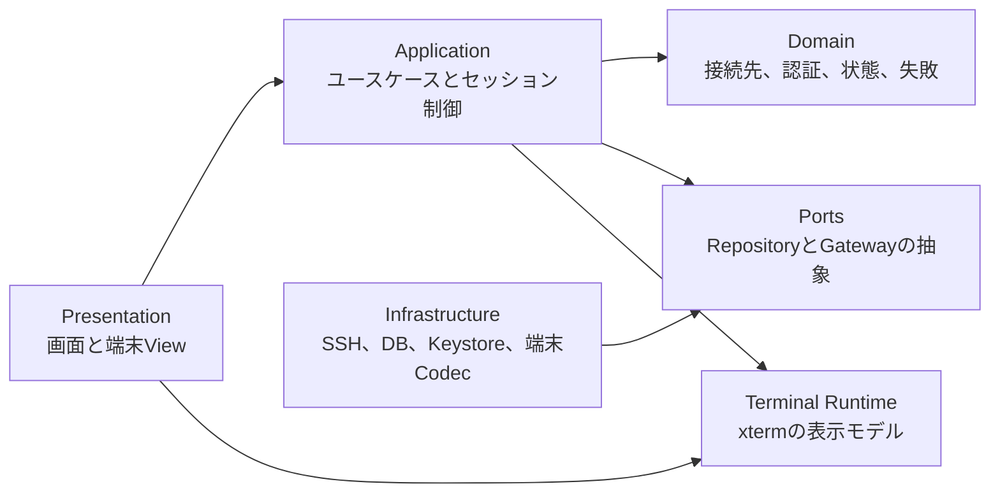
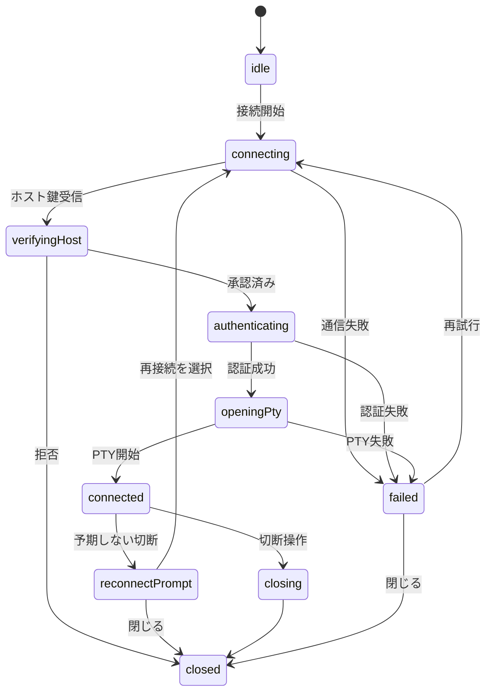
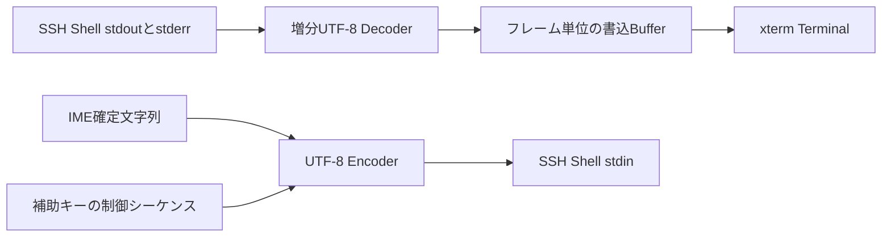

# Android向けSSH・FTPモバイルクライアント設計

最終更新：2026年8月8日

状態：実装中

## 1. 対象と設計判断

このアプリは、Android端末からSSHサーバーへ接続して日本語を含む対話型シェルを操作し、FTPサーバー内のファイルを管理するFlutterアプリである。

初期リリースはAndroid専用とするが、ドメイン層とSSH層にはAndroid APIを持ち込まず、将来のiOS対応を妨げない。

**完全日本語対応**は、画面文言が日本語であることだけを指さない。

日本語IMEによる入力、UTF-8出力、全角文字のセル幅、結合文字、絵文字、日本語フォント、選択と貼り付け、エラー説明までを対象にする。

初期リリースで扱う端末文字コードはUTF-8とする。

Shift_JISとEUC-JPは対象外だが、文字コード変換をSSHセッションから分離し、後から追加できる構造にする。

Androidの最低対応版はAPI 26とする。

`compileSdk`と`targetSdk`は、実装時点のFlutter安定版とGoogle Play要件に合わせて固定する。

## 2. 初期リリースの範囲

初期リリースには次の機能を含める。

- 接続先の登録、編集、複製、削除
- ホスト名、ポート、ユーザー名によるSSH接続
- パスワード認証
- OpenSSH形式の秘密鍵認証と鍵のパスフレーズ入力
- Keyboard-interactive認証
- 初回接続時のホスト鍵確認と、登録済みホスト鍵の照合
- 複数の接続タブ
- 対話型PTYと`xterm-256color`
- 日本語IME入力とUTF-8出力
- `Ctrl`、`Alt`、`Esc`、`Tab`、矢印キーを備えた補助キーバー
- 文字列の選択、コピー、明示的な貼り付け
- 画面回転とウィンドウ寸法変更のPTYへの反映
- 配色、文字サイズ、スクロールバック行数の設定
- 切断理由の日本語表示と、利用者が選択する再接続
- SSH、FTP、設定を切り替える常設ボトムナビゲーション
- FTP、FTPES、FTPSによるファイル一覧の取得
- 接続単位のFTPタブ、パンくず、階層式フォルダー移動
- FTP上のフォルダー作成、名前変更、ファイルと空フォルダーの削除

次の機能は後続リリースへ分離する。

- SFTPファイル管理
- FTPのアップロード、ダウンロード、転送キュー
- ローカル、リモート、Dynamicポートフォワーディング
- ProxyJumpと踏み台接続
- SSH Agent連携
- Mosh
- スニペット同期とクラウド同期
- バックグラウンドでの常時接続
- Shift_JISとEUC-JP

シェルの再接続は、切断前のプロセス状態を復元しない。

状態の継続が必要な利用者には、サーバー側の`tmux`または`screen`を案内する。

## 3. 画面構成

### 3.0 トップレベルナビゲーション

トップレベルは`SSH`、`FTP`、`設定`の三画面をボトムナビゲーションで切り替える。

各ブランチは`StatefulShellRoute`の`IndexedStack`で保持し、FTPタブと一覧位置をナビゲーション切り替えで破棄しない。

SSHターミナルや接続先編集のような集中操作はルートNavigatorへ表示し、ボトムナビゲーションを隠す。

### 3.1 接続先一覧

起動直後に接続先一覧を表示する。

各項目には表示名、`user@host:port`、認証方式、直近の接続結果を表示する。

検索、並べ替え、新規登録、長押しによる編集と複製を提供する。

### 3.2 接続先編集

編集画面は、基本情報、認証、端末、詳細設定の四つに分ける。

入力値は保存前に検証し、ホスト名の空欄、1から65535以外のポート、存在しない認証情報を拒否する。

パスワードと秘密鍵はこの画面に再表示しない。

保存済みであることと、置き換えまたは削除ができることだけを示す。

### 3.3 ホスト鍵確認

初めて見るホスト鍵は、接続処理を停止した状態で確認画面へ渡す。

画面にはホスト名、ポート、鍵アルゴリズム、SHA-256フィンガープリントを表示する。

利用者が承認した場合だけ、登録して接続を続行する。

登録済みの鍵と異なる場合は通常の確認画面を再利用せず、危険性を説明して接続を遮断する。

鍵の置き換えは、接続先編集画面から明示的に行う。

### 3.4 FTPマネージャー

FTP画面上部には接続単位のタブを横スクロールで表示し、タブごとに接続、現在パス、一覧、処理状態を保持する。

現在パスはパンくずとして表示し、ルートまたは任意の上位階層へ直接戻れるようにする。

一覧はフォルダーを先に、その後にファイルを名前順で表示する。

フォルダーのタップで下位階層へ移動し、項目メニューから名前変更と削除を行う。

平文FTPを選んだ場合は、認証情報と通信内容が暗号化されないことを接続前と接続中の両方で明示する。

FTPパスワードは永続化せず、接続タブの寿命だけメモリ上に保持する。

日本語IMEがホスト、ポート、ユーザー名へ全角ASCIIを入力した場合は、接続直前に半角へ正規化する。

パスワードは利用者の意図した値を変えないため正規化しない。

FTPライブラリ固有のClientとEntry型はInfrastructure層に閉じ込め、Presentation層とApplication層は`FtpGateway`と`FtpConnection`だけへ依存する。

### 3.4 ターミナル

ターミナル画面は、上部の接続タブ、中央の端末表示、下部の補助キーバーで構成する。

接続状態は「接続中」「ホスト鍵を確認中」「認証中」「接続済み」「再接続待ち」「切断済み」で表示する。

ソフトウェアキーボードの表示中も、最終行とカーソルが隠れないレイアウトにする。

戻る操作は即時切断に割り当てない。

接続中は、タブを閉じる確認ダイアログを表示する。

### 3.5 設定

設定画面には、テーマ、フォントサイズ、スクロールバック行数、貼り付け確認の文字数、画面消灯中の扱い、診断ログの出力を置く。

診断ログは初期状態で無効とし、有効化してもパスワード、秘密鍵、入力文字列、端末本文を記録しない。

## 4. 論理アーキテクチャ

依存方向は画面からインフラストラクチャへ一方向にする。

ドメイン層はFlutter、SQLite、Android、SSHライブラリに依存しない。



### 4.1 Presentation層

Presentation層はFlutter Widget、画面遷移、入力検証結果の表示、日本語リソースを担当する。

状態管理にはRiverpodを使用する。

ただし、SSHの受信バイト列や端末画面の各セルをRiverpodへ流さない。

高頻度の端末更新を通常のWidget再構築から外し、端末ランタイムへ直接書き込むためである。

### 4.2 Application層

Application層は、接続、ホスト鍵承認、認証情報取得、PTY開始、切断、再接続の順序を制御する。

画面ごとのControllerとは別に、アプリ単位の`SessionRegistry`を置く。

これにより、画面回転やタブ移動でSSH接続が作り直されることを防ぐ。

主要なユースケースは次のとおりである。

- `ListConnectionProfiles`
- `SaveConnectionProfile`
- `DeleteConnectionProfile`
- `ConnectSession`
- `ApproveHostKey`
- `RejectHostKey`
- `DisconnectSession`
- `ResizeTerminal`
- `ImportPrivateKey`
- `ReplaceCredential`

### 4.3 Domain層

Domain層には、接続先、認証方式、ホスト鍵、端末設定、セッション状態、失敗理由を置く。

例外文字列を画面へ直接渡さず、`SshFailureCode`と安全な補足情報へ変換する。

主な失敗コードは次のとおりである。

- `dnsLookupFailed`
- `connectionRefused`
- `connectionTimedOut`
- `hostKeyUnknown`
- `hostKeyMismatch`
- `authenticationFailed`
- `privateKeyInvalid`
- `keyPassphraseRequired`
- `ptyRejected`
- `remoteClosed`
- `networkLost`
- `unsupportedAlgorithm`

### 4.4 Infrastructure層

Infrastructure層は、`dartssh2`、SQLite、Android Keystore、ファイル選択、端末文字コードを抽象へ接続する。

外部ライブラリ固有の型はこの層から外へ出さない。

`dartssh2`を交換またはforkする場合も、Application層と画面を変更しない境界にする。

## 5. SSHセッションの設計

### 5.1 状態機械

一つのタブは一つの`SshSessionController`を所有する。

Controllerは次の状態遷移だけを許可する。



接続処理にはTCP接続、SSHハンドシェイク、認証の個別タイムアウトを設ける。

キャンセル時は、Socket、SSHClient、Shell Channel、購読中のStreamを逆順で閉じる。

複数回の切断操作とライフサイクル通知を受けても安全な、冪等な終了処理にする。

### 5.2 PTY

接続後は`xterm-256color`としてPTYを要求する。

列数と行数は、端末Widgetが計算した値を使用する。

画面回転やキーボード開閉で寸法が変わった場合は、短い間隔でまとめてSSHのwindow-change要求を送る。

サーバーへ`LANG=ja_JP.UTF-8`を常に送信しない。

接続先設定で明示された場合だけ送信し、サーバーが環境変数要求を拒否しても接続自体は継続する。

### 5.3 入出力パイプライン

SSHは文字列ではなくバイト列を運ぶため、受信チャンクの境界を文字境界として扱わない。

UTF-8デコーダーはセッション中保持し、複数チャンクに分割された日本語文字を一文字として復元する。



不正なUTF-8はセッションを終了させず、置換文字を表示して診断カウンターだけを増やす。

受信ごとにWidgetを再構築せず、1フレーム内の小さなチャンクをまとめて端末へ渡す。

送信側ではUnicode正規化を行わない。

ファイル名、コマンド、結合文字の意味をアプリが変えないためである。

## 6. 日本語対応

### 6.1 アプリの日本語化

画面文言はFlutter標準のARBによって管理し、Dartコードへ日本語文字列を直書きしない。

既定ロケールを日本語とし、初期リリースでは`ja`を正式対応ロケールとする。

OS部品、日付、時刻、アクセシビリティラベルも日本語化する。

SSHライブラリの例外文はそのまま表示せず、失敗コードから利用者向けの説明と対処へ変換する。

技術情報が必要な場合は、展開可能な「詳細」に例外種別、接続段階、時刻を表示する。

詳細にも認証情報と端末本文を含めない。

### 6.2 日本語IME

端末WidgetはIMEの変換途中と確定済み文字列を区別し、確定前の文字列をSSHへ送らない。

変換候補の選択中に`Enter`を押した場合は、候補確定とリモートへの改行送信を混同しない。

`xterm`はCJKの幅広文字とIMEをサポートしているため、初期実装の端末エンジンに採用する。

ただし、採用判断は実機試験の代わりにはならない。

Gboardの日本語入力、12キー入力、QWERTY入力、物理キーボードで受け入れ試験を行う。

### 6.3 文字幅とフォント

端末は半角を1セル、一般的な日本語の全角文字を2セルとして描画する。

結合文字、Variation Selector、絵文字、東アジア曖昧幅文字は、リモート側の`wcwidth`実装との差が出やすいため専用テストを置く。

既定フォントには、日本語字形を内包する等幅フォントをアプリへ同梱する。

候補はNoto Sans Mono CJK JPとし、ライセンス、APKサイズ、低解像度での可読性を実装開始時に確認して固定する。

OSのフォントフォールバックだけには依存しない。

フォールバックによって字形ごとの送り幅が変わると、カーソル位置と表示がずれるためである。

フォントサイズ変更後はセル寸法を再計算し、PTYへ新しい列数と行数を送る。

### 6.4 選択と貼り付け

クリップボードは利用者が貼り付けを選んだときだけ読む。

一定文字数を超える貼り付けと改行を含む貼り付けは、内容の先頭を安全にプレビューして確認を求める。

Bracketed Paste Modeが有効な場合は、端末エンジンが生成する制御シーケンスを維持する。

パスワード入力欄からクリップボードへ自動コピーしない。

## 7. データと秘密情報

### 7.1 SQLiteへ保存するデータ

非機密データはDriftを介してSQLiteへ保存する。

初期スキーマは次のテーブルで構成する。

| テーブル | 主な列 | 用途 |
|---|---|---|
| `connection_profiles` | `id`, `name`, `host`, `port`, `username`, `auth_type`, `credential_ref`, `terminal_options`, `created_at`, `updated_at` | 接続先 |
| `known_hosts` | `host`, `port`, `algorithm`, `fingerprint_sha256`, `accepted_at` | ホスト鍵照合 |
| `app_settings` | `key`, `json_value` | 非機密設定 |
| `connection_history` | `profile_id`, `connected_at`, `result_code` | 本文を含まない接続履歴 |

一時的なセッション、端末本文、入力履歴はデータベースへ保存しない。

### 7.2 Keystore配下へ保存するデータ

パスワード、秘密鍵、秘密鍵のパスフレーズは`flutter_secure_storage`のAndroid実装を通して暗号化する。

SQLiteにはランダムな`credential_ref`だけを保存する。

パスワードと秘密鍵のパスフレーズは「毎回入力」を既定とし、利用者が選択した場合だけ保存する。

Android Keystoreの鍵は取り出さず、暗号処理にのみ使用する。

端末のバックアップから暗号文だけが復元されて復号不能になる状態を避けるため、初期リリースではAndroid Auto Backupを無効にする。

接続先の移行機能はAuto Backupに依存させず、秘密情報を含めない明示的なエクスポートとして後から設計する。

秘密鍵のインポートにはAndroid Storage Access Frameworkを使用する。

選択した内容はメモリ上で解析して安全なストレージへ書き込み、アプリ専用領域へ平文ファイルとして複製しない。

秘密値は必要な認証処理の直前に読み出し、ログ、例外、Riverpodの永続状態へ入れない。

## 8. ホスト鍵と認証の安全性

未知のホスト鍵を自動承認する設定は設けない。

ホスト鍵はホスト名とポートの組で登録する。

同じIPアドレスを指す別のホスト名は別の接続先として扱う。

登録済みフィンガープリントとの不一致は、中間者攻撃またはサーバー再構築の可能性があるため接続を遮断する。

認証失敗時は「ユーザー名または認証情報が一致しない」と表示し、パスワードの存在確認に利用できる差分を返さない。

デバッグビルドを含め、次の値をログへ書かない。

- パスワード
- 秘密鍵とパスフレーズ
- Keyboard-interactiveの回答
- リモートへ送った入力
- リモートから受け取った端末本文
- クリップボード内容

## 9. Androidライフサイクル

初期リリースはフォアグラウンド利用を保証範囲とする。

アプリがバックグラウンドへ移っても直ちに切断しないが、Androidによるプロセス停止やネットワーク切断を防げるとは表示しない。

復帰時にSocketとShell Channelを検査し、切れていれば再接続の選択肢を表示する。

画面回転ではActivity再生成の有無にかかわらず`SessionRegistry`を維持する。

画面消灯中も接続を保証する機能を追加する場合は、利用者が明示的に開始するForeground Serviceと常駐通知を別機能として設計する。

## 10. パッケージ構成

初期採用候補は次のとおりである。

バージョンはプロジェクト作成時に互換性を確認し、`pubspec.lock`で固定する。

| 役割 | パッケージ | 採用理由 |
|---|---|---|
| SSH、PTY、SFTP拡張余地 | `dartssh2` | Dart実装で、Android、認証、PTY、ホスト鍵検証を扱える |
| FTP、FTPES、FTPS | `ftpconnect` | 接続、階層移動、一覧取得、基本ファイル操作をDart APIで扱える |
| 端末エミュレーター | `xterm` | Flutter向けで、CJK幅広文字とIMEを扱える |
| 状態管理とDI | `flutter_riverpod` | セッション単位の依存と非同期状態を画面から分離できる |
| 非機密データ | `drift`, `drift_flutter` | 型付きスキーマ、マイグレーション、テスト用インメモリDBを使える |
| 秘密情報 | `flutter_secure_storage` | Android Keystoreを利用した暗号化と生体認証拡張を持つ |
| ローカライズ | `flutter_localizations`, `intl` | Flutter標準のARB生成経路を使える |
| 画面遷移 | `go_router` | 確認画面とタブ画面の経路を宣言できる |
| ファイル選択 | Android SAF対応パッケージ | 秘密鍵を広いストレージ権限なしで選択できる |

`dartssh2`と`xterm`のAPIはInfrastructure層のAdapterに閉じ込める。

パッケージの更新停止や端末互換性の不具合が見つかった場合に、アプリ全体を巻き込まず差し替えるためである。

## 11. ディレクトリ構成

```text
lib/
  app/
    app.dart
    router.dart
    theme/
    l10n/
  features/
    connections/
      presentation/
      application/
      domain/
    terminal/
      presentation/
      application/
      domain/
    ftp/
      presentation/
      application/
      domain/
    settings/
      presentation/
      application/
      domain/
  infrastructure/
    ssh/
    ftp/
    terminal/
    database/
    secure_storage/
    file_picker/
  shared/
    errors/
    logging/
    utils/
test/
  unit/
  widget/
  golden/
integration_test/
tool/
  ssh_test_server/
```

機能ごとのPresentation、Application、Domainを近くに置き、共有される外部接続だけを`infrastructure`へ集める。

## 12. 公開インターフェース

Application層が依存する抽象は、次の責務に分ける。

```dart
abstract interface class SshGateway {
  Future<SshConnection> connect(ConnectRequest request);
}

abstract interface class HostKeyRepository {
  Future<KnownHost?> find(String host, int port);
  Future<void> trust(KnownHost host);
  Future<void> remove(String host, int port);
}

abstract interface class CredentialVault {
  Future<String> put(SecretCredential credential);
  Future<SecretCredential?> read(String reference);
  Future<void> delete(String reference);
}

abstract interface class TerminalCodec {
  Stream<String> decode(Stream<List<int>> source);
  List<int> encode(String input);
}
```

`SshConnection`は受信Stream、送信Sink、PTY寸法変更、終了通知、切断だけを公開する。

ライブラリ固有のClientやChannelを公開しない。

## 13. テスト戦略

### 13.1 Unit Test

状態機械の全遷移、キャンセル、二重切断、タイムアウトをFake Gatewayで検証する。

UTF-8の日本語一文字をすべてのバイト位置で分割し、同じ文字列へ復元されることを検証する。

未知のホスト鍵、同一鍵、変更された鍵の三経路を検証する。

秘密情報がエラー表示とログへ入らないことを検証する。

### 13.2 Widget TestとGolden Test

すべての画面を日本語ロケールで起動し、未翻訳キーが表示されないことを検証する。

小型画面、横画面、フォント倍率1.0、1.3、2.0でレイアウトを比較する。

ソフトウェアキーボード表示時にカーソル行が見えることをWidget Testと実機試験で確認する。

### 13.3 Integration Test

CIでは固定設定のOpenSSHテストサーバーをコンテナで起動する。

パスワード、秘密鍵、暗号化秘密鍵、Keyboard-interactive、認証失敗を検証する。

`echo`だけでなく、`vim`、`tmux`、色、カーソル移動、画面消去、PTY寸法変更を検証する。

日本語の受け入れ文字列には、ひらがな、カタカナ、漢字、半角カナ、濁点結合文字、絵文字、改行を含める。

ホスト鍵を途中で置き換え、不一致時に接続しないことを検証する。

### 13.4 Android実機試験

最低API、現行API、Samsung系端末の三系統を対象にする。

Gboardの12キーとQWERTY、物理Bluetoothキーボード、画面回転、分割画面、ネットワーク切り替えを確認する。

Wi-Fiからモバイル回線へ移った場合は切断または再接続案内を正しく表示し、セッションが維持されたと誤認させない。

## 14. 性能と資源管理

SSHの鍵交換と大量出力でUIスレッドを長時間占有しない。

`dartssh2`が対応する鍵交換のIsolate処理を利用し、端末への書き込みもフレーム単位でまとめる。

スクロールバックは既定10,000行とし、上限を設定する。

タブを閉じたときはSSH接続、Stream購読、端末バッファ、Timerを確実に解放する。

メモリ不足時にバックグラウンドのセッションを暗黙に保存したと表示せず、プロセス再生成後は切断済みとして復元する。

### 14.1 Android可変リフレッシュレート

Androidネイティブ層は、現在の解像度で端末が公開する表示モードから最高リフレッシュレートを選び、`WindowManager.LayoutParams.preferredRefreshRate`でOSへ通知する。

値は強制ではなく希望値として扱われるため、可変リフレッシュレート、電池状態、温度、分割画面などを考慮した最終選択はAndroidへ委ねる。

Flutterのアニメーションは固定フレーム数ではなくVSyncと経過時間を基準に動作させ、60Hz、120Hz、144Hzで同じ所要時間になるようにする。

Android 15以降ではタッチ操作時のフレームレートブーストも有効にする。

SO-41Aの実機が公開する表示モードは60Hzのみだったため、通常の60fps描画と起動は確認するが、可変フレームレート、120fps、144fpsの動作は未テストである。

### 14.2 UIと通信の最適化

ファイル一覧は遅延構築し、日付フォーマッターの再生成を避ける。

FTP制御接続ではコマンドを同時実行せず、現在パス取得と一覧取得を順に処理して応答の競合を防ぐ。

SSH受信はフレーム単位でまとめて端末ランタイムへ渡し、受信チャンクごとのWidget再構築を行わない。

SSH接続準備のうち依存しないホスト鍵検索とTCP接続だけを並列化し、PTY要求とShell要求は一往復へまとめる。

性能評価はデバッグビルドではなくprofileビルドで行い、120HzではUIスレッドとRasterスレッドの双方が8ms以内に収まることを目標にする。

### 14.3 継続的インテグレーション

GitHub ActionsはFlutter 3.44.9とJava 17を使用し、依存解決、フォーマット、静的解析、全テスト、デバッグAPKビルドを実行する。

生成したAPKは14日間のActions artifactとして保存する。

## 15. 実装順序

### 段階1：縦の接続経路

Flutterプロジェクト、ARB、テーマ、接続先一覧を作成する。

一つの接続先から、ホスト鍵確認、パスワード認証、PTY、切断までを実機で通す。

### 段階2：秘密情報と永続化

Drift、Credential Vault、秘密鍵インポート、ホスト鍵データベースを実装する。

Auto Backup除外とログ秘匿を自動テストする。

### 段階3：日本語端末

IME、補助キーバー、等幅日本語フォント、選択、貼り付け、回転、文字幅テストを実装する。

`vim`と`tmux`を使う日本語実機試験を通す。

### 段階4：複数タブと耐障害性

`SessionRegistry`、複数タブ、ネットワーク喪失、タイムアウト、再接続案内、資源解放を実装する。

### 段階5：リリース品質

アクセシビリティ、性能、クラッシュ時の秘匿、署名付きリリースビルドを検証する。

## 16. 初期リリースの完了条件

次の条件をすべて満たした時点で、初期リリースを完了とする。

- 日本語UIに未翻訳の利用者向け文字列がない
- 日本語IMEの変換途中の文字がリモートへ誤送信されない
- ひらがな、カタカナ、漢字、半角カナ、結合文字をUTF-8で往復できる
- `vim`と`tmux`でカーソル位置が主要試験端末上で一致する
- 未知のホスト鍵は承認を求め、変更されたホスト鍵では接続しない
- パスワード、秘密鍵、パスフレーズを平文ファイル、SQLite、ログへ保存しない
- 接続、認証、PTYにタイムアウトとキャンセルがある
- 画面回転とタブ切り替えで接続を作り直さない
- 切断後にSocket、Channel、Stream、Timerが残らない
- Android実機で30分の対話操作と大量出力を行ってクラッシュしない

## 17. 参照資料

- [dartssh2](https://pub.dev/packages/dartssh2)
- [xterm](https://pub.dev/packages/xterm)
- [Flutterアプリの国際化](https://docs.flutter.dev/ui/internationalization)
- [Android Keystore system](https://developer.android.com/privacy-and-security/keystore)
- [flutter_secure_storage](https://pub.dev/packages/flutter_secure_storage)
- [Drift](https://pub.dev/packages/drift)
- [Riverpod](https://pub.dev/packages/flutter_riverpod)
