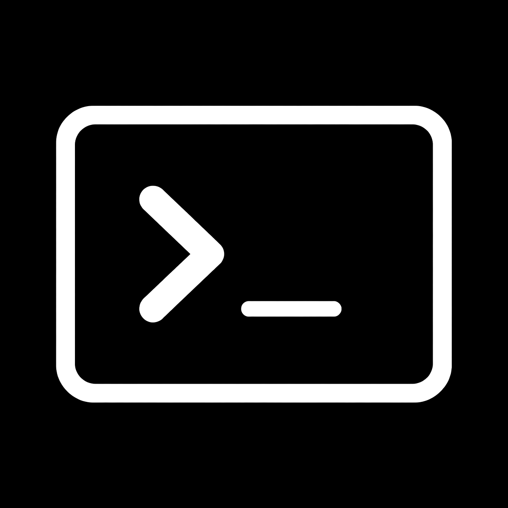

# Termethis



完全日本語対応のAndroid向けSSH・RDP・VNC・FTPクライアントです。

[Android CI](.github/workflows/android.yml)

## 主な機能

- 省メモリなFlutter描画を既定にし、TUI向けxterm.js WebGLへ切り替えられるSSHターミナル
- releaseビルドのFlutter描画で接続中150MiB以下を目標とするメモリ設計
- 日本語IME、UTF-8、CJK文字幅に対応した入出力
- 非表示タブのWebViewを解放し、ANSIスナップショットと受信差分から画面を復元
- Cascadia MonoとNoto Sans JPによるWindows Terminal寄りの表示
- Noto Sans JP、Koruri、Mejiroから選べる日本語フォント
- DriftとSQLiteによるSSH接続先とknown_hostsの永続保存
- 同じ接続先も並行利用できるSSH複数タブ・複数セッション
- アプリ再起動後に切断状態で復元するSSHセッションタブ
- シェル／tmux／zellij／screen向け検索ボタンとOSC 133対応の出力コピー
- TUIマウス、長押し右クリック、対応プロンプト内のタップ移動
- タブバー、画面スリープ抑止、IME表示時リサイズの個別設定
- Android KeystoreとAES-256-GCMによる秘密鍵保管、OpenSSH秘密鍵認証
- RustによるSSHパケット処理、鍵交換、認証、PTY、複数セッション管理
- RustによるSFTPファイル操作と上限付き受信バッファ・バックプレッシャー
- ホームの接続先としてSSH・RDP・VNCを一元管理
- Androidの対応アプリへRDP URIまたはVNC URIを渡すリモートデスクトップ連携
- 接続先ごとのWake on LAN設定とMagic Packet送信
- ホーム、FTP、設定を切り替えるボトムナビゲーション
- FTP、FTPES、FTPS、SFTP接続と複数タブ
- パンくずによる階層移動、フォルダー優先の一覧表示
- フォルダー作成、名前変更、ファイルと空フォルダーの削除
- 適応・バランス・最大から選べるAndroidネイティブのリフレッシュレート制御
- 2,000・5,000・10,000行から選べるスクロールバック
- 600dp以上でNavigationRailへ切り替わるレスポンシブUI
- 明示設定時だけ接続中に動くバックグラウンドSSH通知

平文FTPでは認証情報と通信内容が暗号化されません。可能な接続先ではSFTP、FTPES、FTPSのいずれかを使用してください。

SSHセッションの保存対象はタブID、接続先ID、表示名だけです。SSH通信、端末の表示内容、パスワード、秘密鍵は保存せず、アプリのプロセス再生成後は切断状態から利用者が再接続します。

RDPとVNCはAndroidにインストールされた対応クライアントを起動します。Termethisは接続先とユーザー名だけを渡し、リモートデスクトップのパスワードは保存・転送しません。

## 開発

Flutter 3.44.9とDart 3.12.2を使用します。
SSH・SFTPコアにはRust 1.96.0を使用し、`flutter_rust_bridge`でFlutterへ接続します。

```powershell
flutter pub get
cargo check --manifest-path rust/Cargo.toml
flutter analyze
flutter test
flutter build apk --debug
```

xterm.jsアセットを変更した場合は、APKビルド前に次を実行します。

```powershell
Set-Location tool/web_terminal
npm install
npm run build
```

### WSLを使うAndroid SSH試験

ネイティブ暗号のローカルビルドにはCMake、C/C++コンパイラー、NASMが必要です。GitHub Actionsではこれらをワークフロー内で導入します。

通常のWSL環境と分離したテスト用sshdを起動し、エミュレータだけを接続します。パスワードはテストのたびに指定し、アプリには保存しません。

```powershell
.\tool\wsl\setup_test_ssh.ps1 -Distro Ubuntu -Password '<一時テスト用パスワード>'
adb -s emulator-5554 reverse tcp:22222 tcp:22222
```

Termethisの接続先は`termethis-test@127.0.0.1:22222`にします。終了時は`.\tool\wsl\stop_test_ssh.ps1`を実行します。

ヘッドレスAVDでWebGLを検証する場合は`-gpu host`を使用してください。環境別の既知事項は[TESTING.md](TESTING.md)にまとめています。

WebGLの初期化やWebView通信に失敗した場合は、そのセッション画面だけFlutter互換描画へ自動的に切り替わります。設定値は変更しないため、次に端末画面を開いたときはWebGLを再試行します。

設計と安全性は[ARCHITECTURE.md](ARCHITECTURE.md)、評価環境と実測結果は[TESTING.md](TESTING.md)を参照してください。

## 高リフレッシュレートの検証状況

既定の「適応」は固定Hzを要求せずOSに評価を任せます。「バランス」は通常60Hz相当で、タッチ、スクロール、端末出力中だけ高Hzを要求し、停止から約750ms後に戻します。「最大」だけが最高Hzを継続要求します。

省電力、熱制限、分割画面ではOSの判断を優先します。可変リフレッシュレート、高Hz、各種IME、デスクトップ表示、画面消灯中の接続維持は環境別に検証します。
